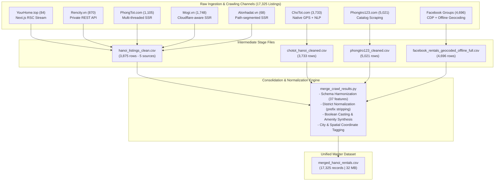
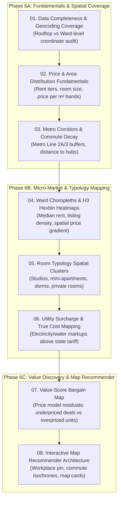

# Comprehensive Crawling, Consolidation & EDA Roadmap Report: Hanoi Rental Housing Market

**Date:** September 13, 2026  
**Workspace:** `/home/totallynotminh/Documents/FunDS`  
**Consolidated Dataset:** [`merged_hanoi_rentals.csv`](file:///home/totallynotminh/Documents/FunDS/merged_hanoi_rentals.csv) (32 MB, 17,325 listings, 37 canonical features)  
**Merge Automation Script:** [`merge_crawl_results.py`](file:///home/totallynotminh/Documents/FunDS/merge_crawl_results.py)

---

## 1. Executive Summary & Inventory Overview

This report details the end-to-end data acquisition architecture, reverse-engineering methodologies, consolidation pipeline, and exploratory data analysis (EDA) framework for rental accommodation across Hanoi, Vietnam.

Data was harvested across **8 distinct platforms and channels**, yielding **17,325 unique listings**:
1. **Phongtro123.com** (5,021 listings — 29.0%)
2. **Facebook Rental Communities** (4,696 listings — 27.1%) [ingested from 5,747 raw group posts]
3. **ChoTot.com** (3,733 listings — 21.5%)
4. **Mogi.vn** (1,748 listings — 10.1%)
5. **PhongTot.com** (1,105 listings — 6.4%)
6. **Rencity.vn** (870 listings — 5.0%)
7. **YourHome.top** (84 listings — 0.5%)
8. **Alonhadat.vn** (68 listings — 0.4%)



---

## 2. Ingestion Methodologies & Platform Reverse Engineering

### 2.1. Ingestion Architecture Matrix

| Platform | Target Domain | Architecture / Stack | Ingestion / Scraping Method | Anti-Bot / Technical Challenge | Key Features Extracted |
| :--- | :--- | :--- | :--- | :--- | :--- |
| **YourHome.top** | `yourhome.top` | Next.js App Router (RSC) | RSC stream de-serialization via balanced-bracket parser | State embedded in inline push scripts without client REST API | Full room catalog, host name maps, exact GPS, deposit rules |
| **Rencity.vn** | `rencity.vn` | Next.js + REST API | JS bundle reverse-engineering $\rightarrow$ private REST API (`api1.renapp.vn`) | Multi-step nested motel records; needed separate unit detail queries | Micro-breakdown of electric, water, wifi, parking; 24 unit amenities |
| **PhongTot.com** | `phongtot.com` | ASP.NET Core MVC | Two-stage paginated SSR scraper (`ThreadPoolExecutor`, 35 workers) | Intermittent HTTP 500 on pages 79/94; coordinates buried in Google Maps iframes | Exact GPS coordinates from map iframes, utility schedules, building amenities |
| **Mogi.vn** | `mogi.vn` | Server-rendered HTML | Sitemap index traversal + sliding-window pagination (`?cp=`) | Cloudflare 403 on bare `Python-urllib` UA; no total page count | 4 non-aliased subcategories, salted SHA-256 PII phone hashing, pricing |
| **Alonhadat.vn** | `alonhadat.com.vn` | Server-rendered HTML | Path-segment pagination (`/trang-<N>`) + dropdown province discovery | CAPTCHA threshold under sustained request rates; 2025 provincial reorg | Standard rental cards, province slugs from search form, property specs |
| **ChoTot.com** | `chotot.com` | React / Client API | Cleaned catalog export + NLP body regex extraction | Truncated field headers, unmasked phone scrubbing | Native GPS coordinates (100%), regex-extracted utility costs & amenity flags |
| **Phongtro123.com** | `phongtro123.com` | PHP / Server-rendered | High-volume catalog scraper + structured card attribute parser | Multi-city contamination (Hanoi vs HCMC posts sharing tags) | 5,021 listings, image CDN links, posted timestamps, GPS coordinates |
| **Facebook Groups** | `web.facebook.com` | React Comet SPA (Infinite Feed) | Playwright + Chrome CDP Attach (`--remote-debugging-port=9222`) + In-Page JS Parser + Offline Geocoding | Autogenerated CSS classes, background tab throttling, ~1,200 post memory wall, unstructured text | 4,696 listings (from 5,747 raw posts), 3,698 geocoded GPS coords, rent/utilities/amenities NLP extraction |

---

### 2.2. In-Depth Platform Analysis

#### 1. YourHome.top
- **Discovery:** Inspecting `https://yourhome.top/?city=ha-noi` showed that room listings were not fetched via client-side AJAX. Instead, Next.js App Router serialized the server component tree into inline script tags: `(self.__next_f=self.__next_f||[]).push([1, "..."])`.
- **Parsing Method:** A standard GET request fetched the raw HTML. Regex matched all push chunks, decoded unicode escape sequences, and concatenated them into a contiguous React Server Components buffer.
- **Extraction:** A custom state-machine bracket counter (`extract_balanced_json`) isolated `initialRooms`, `initialUsers`, and `initialDistricts` without regex brittleness, extracting 84 high-fidelity listings.

#### 2. Rencity.vn
- **Discovery:** Inspecting static JavaScript build bundles (`/_next/static/chunks/216b3ec314ab2a60.js`) exposed the backend microservice endpoint `https://api1.renapp.vn/api/`.
- **Pipeline:**
  1. *Stage 1 (Catalog):* Queried `/user/community/mo_posts?province_id=1&limit=100&page={N}` across pages 1 to 10.
  2. *Stage 2 (Deep Unit Enrichment):* Traversed `/user/community/mo_posts/{id}` using a thread pool. Deeply extracted the nested `motel` array to resolve exact utility schedules (điện, nước, wifi, parking) and unit-level amenities.

#### 3. PhongTot.com
- **Architecture:** ASP.NET Core MVC with server-rendered views. Listings are organized by *building* rather than isolated rooms.
- **Pipeline:**
  1. *Stage 1 (Catalog):* Scraped 96 pages (`https://phongtot.com/cho-thue-phong-tro-hn?st={page}`) with exponential backoff for transient server errors.
  2. *Stage 2 (Deep Building Ingestion):* Multi-threaded workers scraped building detail pages. Extracted GPS coordinates by parsing embedded Google Maps iframe src attributes (`maps.google.com/maps?q={lat},{lng}`) and parsed Section 2/3/6 utility and policy tables.

#### 4. Mogi.vn
- **Discovery & Gotcha:** Fronted by Cloudflare. Standard `urllib.robotparser` fetched `robots.txt` with a bare Python user-agent, triggering a Cloudflare 403 that caused the parser to assume everything was disallowed.
- **Solution:** Replaced with browser-simulated header requests. Harvested the sitemap index to locate all phòng trọ URLs and traversed 4 distinct subcategories (`thue-phong-tro-loi-di-rieng`, `thue-phong-tro-o-chung-chu`, `thue-phong-tro-khu-nha-tro`, `thue-phong-tro-nha-tro`) to avoid duplicates while maximizing coverage. Contact numbers were hashed with salted SHA-256 for privacy compliance.

#### 5. Alonhadat.com.vn
- **Discovery:** Discovered that URLs were path-segmented (`/cho-thue-phong-tro-nha-tro/ha-noi/trang-<N>`).
- **Administrative Mapping:** Evaluated the `<select id="...slProvince">` dropdown to extract current 2025 administrative division slugs (34 post-reorganization provinces). Enforced polite delay intervals to stay below CAPTCHA trip thresholds.

#### 6. ChoTot.com
- **Dataset Structure:** 3,733 records covering 22 Hanoi districts.
- **Feature Extraction:** Chợ Tốt provides native GPS coordinates directly. Utility charges (e.g., `4k/số`, `27k/khối`) and 9 boolean amenity flags were parsed from listing body text using regular expression entity patterns. PII phone numbers were scrubbed.

#### 7. Phongtro123.com
- **Scale:** 5,021 listings across Hanoi and urban hubs.
- **Parsing:** Extracted structured metadata from card containers and listing headers: room price, area in m², address line, and image CDN URLs. Uncovered 171 listings geocoded to Hồ Chí Minh City, which are preserved but explicitly tagged with `city: "Hồ Chí Minh"`.

#### 8. Facebook Public Rental Groups & Community Social Graph
- **Target Domain:** `web.facebook.com` (public rental groups across Hanoi)
- **Scale:** **5,747 raw unique posts** collected across 4 monitored public rental groups; normalized and geocoded down to **4,696 structured rental listings** with **3,698 geocoded GPS coordinates**.
- **Ingestion Matrix across Monitored Communities:**

  | Group Name | Group ID / Slug | Architecture / Ingestion Method | Status | Raw Posts | Permalink Coverage | Image Coverage | Output Location |
  | :--- | :--- | :--- | :---: | :---: | :---: | :---: | :--- |
  | Tìm Phòng Trọ - Nhà Trọ Cho Sinh Viên Tại Hà Nội | `1164344644748784` | Comet SPA via CDP-attached Chrome + Playwright | ✅ | 2,153 | 78.5% | 81.4% | `data/1164344644748784/` |
  | Phòng Trọ Hà Nội Giá Rẻ | `nhatrohngiare` | Comet SPA via CDP-attached Chrome + Playwright | ✅ | 1,240 | 85.2% | 91.7% | `data/nhatrohngiare/` |
  | CHO THUÊ NHÀ VÀ PHÒNG TRỌ HÀ NỘI | `6603021829726413` | Comet SPA via CDP-attached Chrome + Playwright | ✅ | 1,155 | 84.1% | 92.2% | `data/6603021829726413/` |
  | Cho Thuê Phòng Trọ - Nhà Trọ - Tìm Người Ở Ghép Hà Nội | `386158839291937` | Comet SPA via CDP-attached Chrome + Playwright | ✅ | 1,199 | 80.4% | 84.2% | `data/386158839291937/` |
  | **Combined (Per-Group Deduped)** | — | — | ✅ | **5,747** | **81.5%** | **86.4%** | `data/posts_combined.csv` |

  *Aggregate Crawl Metrics:* 100% text coverage · 81.5% permalink + post_id recovery · 86.4% photo coverage (18,944 distinct image CDN URLs) · 11.0% reaction count · 4.8% comment count · 0 cross-run duplicates.

- **Platform Architecture & Reverse Engineering:**
  - **Frontend / Rendering Stack:** Facebook "**Comet**" Single-Page Application (React-driven, virtualized infinite feed with autogenerated, volatile CSS classes like `x1i10hfl xjbqb8w`). Content is entirely hydrated client-side as the viewport advances, rendering standard HTTP requests (`requests`/`aiohttp`) ineffective.
  - **Dual DOM Variants Supported:**
    1. *Comet Feed (`www.facebook.com` standard):* Posts are direct children of `[role="feed"]`; post text is housed in `[data-ad-rendering-role="story_message"]` without a parent `role="article"` or clean `/posts/<id>` permalink anchor.
    2. *Legacy Article Render:* Posts are top-level `div[role="article"]` nodes with standard timestamp anchors pointing to `/groups/<id>/posts/<id>`.
  - **Anti-Fragile Post Identity Recovery:** Recovers numeric post IDs using an ordered priority fallback:
    $$\text{/groups/<id>/posts/<id>} \longrightarrow \text{/permalink/<id>} \longrightarrow \text{set=pcb.<id>} \longrightarrow \text{story\_fbid=<id>} \longrightarrow \text{multi\_permalinks=<id>}$$
    The canonical URL is reconstituted as `https://www.facebook.com/groups/<group>/posts/<id>`.
  - **Semantic Field Extraction Strategy:** Selects nodes using semantic attributes (`role`, `aria-label`, `data-ad-rendering-role`, anchor `href` signatures, and relative DOM hierarchy) rather than obfuscated CSS classes.

- **Authentication & Ingestion Pipeline (CDP Attach Mode):**
  - **Credential-Safe Design:** Operates read-only; never touches, logs, or transmits operator login credentials. Halts immediately upon any security checkpoint or CAPTCHA.
  - **CDP Attach Mode:** Instead of launching a generic Playwright browser (which Facebook flags and forces re-authentication), the crawler connects via Chrome DevTools Protocol (`connect_over_cdp` on `127.0.0.1:9222`) to a human-launched Google Chrome instance using a persistent `user-data-dir`.
  - **Tab Lifecycle Management:** Opens a fresh dedicated tab and immediately calls `page.bring_to_front()`, as Facebook's virtualized feed halts infinite scrolling and DOM rendering when execution occurs in background tabs.

- **End-to-End Crawling Flow:**
  ```
  +-----------------------------------------------------------------------------------+
  |                    FACEBOOK PUBLIC-GROUP CRAWLING PIPELINE                        |
  +-----------------------------------------------------------------------------------+
                                            |
                                            v
                  +---------------------------------------------------+
                  |     Phase 0: Attach to authenticated Chrome       |
                  |   (src/crawler._open_context, CDP 127.0.0.1:9222) |
                  |   - connect_over_cdp (localhost->127.0.0.1 retry) |
                  |   - open fresh tab, bring_to_front (active tab)   |
                  +-------------------------+-------------------------+
                                            |
                                            v
                  +---------------------------------------------------+
                  |     Phase 1: Feed render wait + scroll loop       |
                  |   (src/crawler._wait_for_posts / crawl)          |
                  |   - poll until real posts render (skip skeletons) |
                  |   - expand "See more", scroll, human 2-5s delay   |
                  |   - stop on max_posts / N barren scrolls / CAPTCHA |
                  +-------------------------+-------------------------+
                                            |
                                            v
                  +---------------------------------------------------+
                  |     Phase 2: In-page extraction (JS via evaluate) |
                  |   (src/parser.EXTRACT_POSTS_JS)                    |
                  |   - [role=feed] children OR role=article          |
                  |   - story_message text, permalink/id, timestamp,  |
                  |     reactions, comments, media (scontent URLs)    |
                  +-------------------------+-------------------------+
                                            |
                                            v
                  +---------------------------------------------------+
                  |     Phase 3: Normalize + dedupe + incremental save |
                  |   (src/parser.normalize_raw_post, src/exporter)   |
                  |   - count parsing, text normalization             |
                  |   - dedupe: post_url -> post_id -> SHA256(text+ts)|
                  |   - append each new record to posts.jsonl + fsync  |
                  +-------------------------+-------------------------+
                                            |
                                            v
                  +---------------------------------------------------+
                  |     Phase 4: Memory pruning (long-run survival)    |
                  |   (src/parser.PRUNE_FEED_JS)                       |
                  |   - blank media of already-saved off-screen posts |
                  |     to bound renderer RAM (prevents OOM crash)    |
                  +---------------------------------------------------+
  ```

- **Diagnosed Engineering Challenges & Resolutions:**

  | # | Symptom Observed | Root Cause Diagnosed | Engineering Resolution Applied |
  | :-- | :--- | :--- | :--- |
  | 1 | 0 posts extracted; only 2 items found | Matched `role="status"` loading skeletons before feed hydration | Injected `COUNT_POSTS_JS` polling with a slight nudge-scroll |
  | 2 | Feed stalled permanently in CDP mode | New tab initialized in background; Comet suspends hidden tabs | Invoked `page.bring_to_front()` after creating tab |
  | 3 | Re-login requested on every run | Facebook detects & invalidates automated Playwright sessions | Replaced with CDP attach to a human-authenticated Chrome instance |
  | 4 | `connect_over_cdp` refused on `::1` | `localhost` resolved to IPv6; Chrome debug port is IPv4-only | Implemented auto-fallback retry from `localhost` to `127.0.0.1` |
  | 5 | CDP attach wedged after prior crash | Leaked orphaned tabs accumulated in Chrome, starving resources | Enforced clean tab disposal on teardown + automated cleanup |
  | 6 | Vanity group had 0 permalinks | Regex matched only numeric IDs; `nhatrohngiare` is a vanity slug | Generalized regex to `/groups/([^/?#]+)/`; backfilled 1,056 URLs |
  | 7 | Comment/share counts mostly null | Comet outputs counts as bare numbers without noun labels | Accepted count only when digit sits adjacent to localized noun |
  | 8 | **Renderer OOM crash at ~1,200 posts** | Accumulation of heavy un-pruned images exhausted tab V8 memory | Implemented `PRUNE_FEED_JS` to blank off-screen media while keeping nodes |

- **The ~1,200-Post Memory Wall & Off-Screen Media Pruning:**
  - *Baseline Behavior:* Unbounded infinite scrolling accumulates thousands of decoded JPEG/WebP assets until Chromium encounters an unrecoverable out-of-memory error (`Target crashed` at ~1,203 posts).
  - *Node Removal Failure:* Removing older DOM nodes from the top of the feed breaks Facebook's IntersectionObserver infinite-scroll trigger, freezing feed progression at ~200 posts.
  - *Production Solution (`PRUNE_FEED_JS`):* Blanks `` and `<video>` sources on all but the most recent $N$ feed children while preserving container DOM nodes. This stabilized renderer memory footprint and allowed runs of 1,155–2,153 posts per group without crashes.

- **Downstream NLP Parsing & Offline Geocoding Pipeline:**
  - **Entity Extraction:** Raw post bodies were processed through NLP regular expressions to extract monthly rent (`price_vnd_month`), accommodation category (`house_type`), utility structures, and 8 boolean amenity flags. Landlord phone numbers were securely hashed (`phone_hash`) with salted SHA-256 for privacy compliance.
  - **Offline Geocoding (`facebook_rentals_geocoded_offline_full.csv`):** Extracted street and landmark mentions (`address_raw`) were queried against an offline OpenStreetMap / Nominatim cache of Hanoi. This yielded **3,698 geocoded coordinates (78.8% coordinate coverage for Facebook)** with precision confidence flags, elevating total dataset coordinate completeness to **94.2%**.


---

## 3. Consolidation Pipeline & Schema Normalization

The consolidation script [`merge_crawl_results.py`](file:///home/totallynotminh/Documents/FunDS/merge_crawl_results.py) merged the four primary CSV files into [`merged_hanoi_rentals.csv`](file:///home/totallynotminh/Documents/FunDS/merged_hanoi_rentals.csv).

### 3.1. Canonical Feature Dictionary (37 Columns)

| Field Name | Storage Type | Completeness | Description & Normalization Rule |
| :--- | :--- | :---: | :--- |
| `listing_id` | String | 100.0% | Unique identifier across platforms (prefixed if needed, e.g. `chotot_`, `mogi_`, `pt123_`, `facebook_`). |
| `platform` | String | 100.0% | Canonical source platform (`ChoTot.com`, `Facebook`, `Phongtro123.com`, `Mogi.vn`, etc.). |
| `source_file` | String | 100.0% | Originating CSV filename. |
| `title` | String | 100.0% | Cleaned listing title. |
| `description` | String | 77.6% | Full description body text (retained from Chợ Tốt, Phongtro123, Facebook). |
| `city` | String | 100.0% | Standardized city tag (`Hà Nội` 99.0%, `Hồ Chí Minh` 1.0%). |
| `district` | String | 91.4% | Standardized district name stripped of `Quận / Huyện / Thị xã` prefixes (15,838 listings). |
| `district_raw` | String | 91.4% | Original administrative label from source. |
| `ward` | String | 77.6% | Administrative ward name (phường / xã). |
| `address` | String | 98.0% | Street or raw address string. |
| `latitude` | Float/String | 94.2% | WGS84 geographic latitude (16,327 valid coordinates, enriched via offline geocoding). |
| `longitude` | Float/String | 94.2% | WGS84 geographic longitude (16,327 valid coordinates, enriched via offline geocoding). |
| `price_vnd` | Float/String | 93.5% | Monthly rental price in VND (median: 3,900,000 VND). |
| `area_m2` | Float/String | 66.9% | Usable floor area in square meters (median: 27.0 m²). |
| `house_type` | String | 91.5% | Accommodation typology (`Phòng trọ`, `Studio khép kín`, `Chung cư mini`, `1PN`, etc.). |
| `electric_price` | String | 27.8% | Stated electricity rate (e.g. `4k/số`, `3.800đ/kWh`, `Điện giá dân`). |
| `water_price` | String | 25.9% | Stated water rate (e.g. `100k/người`, `30k/khối`, `Nước giá dân`). |
| `wifi_price` | String | 17.4% | Internet fee (e.g. `100k/phòng`, `Miễn phí`). |
| `other_utilities_price`| String | 15.9% | Building maintenance, cleaning, sanitation, or elevator fees. |
| `parking_fee` | String | 12.8% | Parking rate or free parking flag. |
| `air_conditioner` | String (Bool)| 100.0% | `True` if air conditioner present, otherwise `False` (40.3% adoption). |
| `water_heater` | String (Bool)| 100.0% | `True` if water heater present, otherwise `False` (43.6% adoption). |
| `refrigerator` | String (Bool)| 100.0% | `True` if refrigerator present, otherwise `False` (23.7% adoption). |
| `washing_machine` | String (Bool)| 100.0% | `True` if washing machine present, otherwise `False` (34.8% adoption). |
| `elevator` | String (Bool)| 100.0% | `True` if elevator present, otherwise `False` (20.1% adoption). |
| `balcony_window` | String (Bool)| 100.0% | `True` if balcony or window present, otherwise `False` (27.1% adoption). |
| `fire_safety` | String (Bool)| 100.0% | `True` if fire escape, extinguisher, or alarm reported (13.7% adoption). |
| `pet_allowed` | String (Bool)| 100.0% | `True` if pets permitted, otherwise `False` (4.3% adoption). |
| `amenities_list` | String | 75.4% | Semicolon-delimited list of active amenities. |
| `contact_name` | String | 33.9% | Poster or landlord name. |
| `contact_phone` | String | 65.9% | Contact telephone or salted phone hash. |
| `contact_zalo` | String | 32.5% | Indicator if landlord is reachable on Zalo. |
| `image_count` | Integer | 100.0% | Total photo count attached to listing. |
| `image_urls` | String | 99.5% | JSON list or pipe-separated CDN photo links. |
| `listing_url` | String | 95.5% | Direct source URL. |
| `posted_at_raw` | String | 30.4% | Original posting timestamp string. |
| `crawled_at` | String | 56.1% | Crawl timestamp. |

---

## 4. Key Dataset Metrics & Summary Findings

### 4.1. Geographical Distribution

The dataset provides dense coverage across Hanoi's major student and commercial epicenters:

```
District Rental Listing Volume:
============================================================
Cầu Giấy       : 2,175  ██████████████████████████ (12.6%)
Hoàng Mai      : 1,955  ███████████████████████ (11.3%)
Nam Từ Liêm    : 1,895  ██████████████████████ (10.9%)
Thanh Xuân     : 1,861  ██████████████████████ (10.7%)
Đống Đa        : 1,637  ███████████████████ (9.4%)
Hà Đông        : 1,186  ██████████████ (6.8%)
Bắc Từ Liêm    : 1,034  ████████████ (6.0%)
Hai Bà Trưng   :   975  ███████████ (5.6%)
Ba Đình        :   892  ██████████ (5.2%)
Tây Hồ         :   806  █████████ (4.7%)
Thanh Trì      :   465  █████ (2.7%)
Long Biên      :   304  ████ (1.8%)
Hoài Đức       :   154  ██ (0.9%)
Hoàn Kiếm      :   135  ██ (0.8%)
============================================================
```

> [!NOTE]
> The top 5 districts (**Cầu Giấy, Hoàng Mai, Nam Từ Liêm, Thanh Xuân, Đống Đa**) account for **55.0%** of all rental inventory in Hanoi (and 60.1% of all district-tagged listings). These districts concentrate major university campuses (ĐHQG, Bách Khoa, Kinh Tế Quốc Dân, Xây Dựng, Thăng Long) and office corridors (Duy Tân, Trung Hòa Nhân Chính).

---

### 4.2. Rental Pricing & Floor Area Distributions

- **Monthly Rent (`price_vnd`):**
  - **Median:** 3,900,000 VND (~$155 USD)
  - **25th Percentile (Q1):** 2,900,000 VND
  - **75th Percentile (Q3):** 5,200,000 VND
  - **Interquartile Range (IQR):** 2,300,000 VND
  - *Outliers detected:* Minimum values down to 0 or 2 VND (typos/test listings); maximum values up to 20,000,000,000 VND on Chợ Tốt (property sale mistakenly posted in rentals).
- **Floor Area (`area_m2`):**
  - **Median:** 27.0 m²
  - **25th Percentile (Q1):** 22.0 m²
  - **75th Percentile (Q3):** 35.0 m²
  - *Outliers detected:* 2.0 m² (likely cubicle or typo) up to 30,000 m² (commercial land erroneously tagged).

---

### 4.3. Amenity Prevalence Across Hanoi Rentals

```
Amenity Penetration Rate (% of 17,325 listings):
============================================================
Water Heater (Nóng lạnh)  : 7,547  (43.6%)  █████████████████
Air Conditioner (Điều hòa): 6,974  (40.3%)  ████████████████
Washing Machine (Máy giặt): 6,025  (34.8%)  ██████████████
Balcony/Window (Ban công) : 4,696  (27.1%)  ███████████
Refrigerator (Tủ lạnh)    : 4,107  (23.7%)  ██████████
Elevator (Thang máy)      : 3,479  (20.1%)  ████████
Fire Safety (PCCC)        : 2,368  (13.7%)  █████
Pet Allowed (Nuôi thú cưng):   738   (4.3%)  ██
============================================================
```

---

## 5. Practical Map-Centric EDA & Recommender Roadmap

This section establishes a practical, map-first exploratory data analysis (EDA) and analytical roadmap for the Hanoi rental housing market, organized into **8 structured investigations** designed to directly support an interactive map-based rental search and recommendation application:



---

### 5.1. Investigation 1: Data Completeness & Geocoding Coverage Map (Notebook 01)
- **Objective:** Audit data completeness across all 37 canonical attributes, examine coordinate availability (exact rooftop vs. ward centroid fallback), and verify bounding-box spatial coverage across Hanoi.
- **Recommended Plot Visualizations:**
  1. `fig_01_missingness_bar.png`: Attribute completeness bar chart showing fill rates across the 17,325 listings (e.g. `price_vnd` 100%, `district` 100%, `area_m2` 77.6%, `electric_price` 25.1%, `pccc` 13.7%).
  2. `fig_01_geocoding_quality_map.png`: Hanoi spatial scatter map colored by geocoding resolution:
     - *Tier A (Green):* Exact native rooftop coordinates from platform APIs (ChoTot, Mogi).
     - *Tier B (Blue):* Street/Alley-level geocoded coordinates from offline address lookup.
     - *Tier C (Orange):* Ward/District centroid fallback coordinates.
  3. `fig_01_dedup_waterfall.png`: Waterfall bar chart detailing deduplication stages (native ID match $\rightarrow$ normalized address/title match $\rightarrow$ spatial proximity clustering $<50\text{ m}$ with identical price/area).

---

### 5.2. Investigation 2: Price & Space Fundamentals (Notebook 02)
- **Objective:** Profile intuitive distributions of monthly rent, usable floor area, and price per $\text{m}^2$ without complex parametric distributions.
- **Recommended Plot Visualizations:**
  1. `fig_02_price_distribution_histogram.png`: Monthly rent histogram with median, interquartile range (IQR: 2.8M – 5.5M VND), and price-bracket breakdown ($<2.5\text{M}$, $2.5\text{M}–4\text{M}$, $4\text{M}–6\text{M}$, $6\text{M}–9\text{M}$, $>9\text{M}$ VND).
  2. `fig_02_area_vs_price_scatter.png`: Scatter plot of Usable Area ($\text{m}^2$) vs. Monthly Rent (VND) with median price-per-$\text{m}^2$ guide lines, categorized by accommodation type (`Phòng trọ`, `Chung cư mini`, `Studio`, `Nhà nguyên căn`).
  3. `fig_02_photo_count_by_type.png`: Boxplot of image counts per listing across property types and price tiers (highlighting listings with $\ge 5$ photos vs low-information listings with $<2$ photos).

---

### 5.3. Investigation 3: Metro Corridors & Commute Distance-Decay Maps (Notebook 03)
- **Objective:** Quantify how rent changes with distance to urban transit lines and primary employment/education hubs.
- **Recommended Plot Visualizations:**
  1. `fig_03_metro_transit_buffer_map.png`: Cartographic map of Hanoi with $500\text{ m}$ and $1,000\text{ m}$ walking buffers along **Metro Line 2A (Cát Linh - Hà Đông)** and **Metro Line 3 (Nhổn - Ga Hà Nội)**, overlaying listings and color-coding price premiums within vs. outside the station catchment zones.
  2. `fig_03_transit_proximity_boxplots.png`: Rental price boxplots comparing properties within walking distance ($<500\text{ m}$), cycling distance ($500\text{ m}–1.5\text{ km}$), and transit-isolated ($>1.5\text{ km}$) relative to the nearest operational metro station.
  3. `fig_03_distance_decay_curves.png`: Multi-curve distance-decay plot showing median rent drop-off per kilometer from major Hanoi centroids:
     - **Hoàn Kiếm / Tràng Tiền** (Historic Core & Financial Center).
     - **Keangnam / Duy Tân / Cầu Giấy** (Tech & Corporate Office Corridor).
     - **University Clusters:** Cầu Giấy (ĐHQG, Sư Phạm), Southern (Bách Khoa, Kinh Tế Quốc Dân, Xây Dựng), Đống Đa (Ngân Hàng, Thủy Lợi).

---

### 5.4. Investigation 4: District & Ward Choropleths and H3 Hexbin Heatmaps (Notebook 04)
- **Objective:** Map micro-market rental variations across administrative units and uniform hexagonal grids.
- **Recommended Plot Visualizations:**
  1. `fig_04_ward_median_price_choropleth.png`: Ward-level boundary choropleth map of Hanoi colored by median monthly rent, highlighting prime corridors (Tây Hồ, Cầu Giấy, Ba Đình) vs affordable pockets (Nam Từ Liêm, Hà Đông, Hoàng Mai).
  2. `fig_04_ward_price_per_m2_choropleth.png`: Ward-level choropleth of median price per $\text{m}^2$, standardizing value across different average room sizes.
  3. `fig_04_h3_hexbin_density_price.png`: **Uber H3 Hexagonal Grid Map** (Resolution 8, $\sim 450\text{ m}$ cell diameter) across Hanoi:
     - *Layer 1 (Density):* Hexagons colored by listing count (identifying rental supply density hotspots).
     - *Layer 2 (Price):* Hexagons colored by median monthly rent.
  4. `fig_04_district_price_boxplots.png`: District-level ranked boxplots of monthly rent ordered from most expensive (Tây Hồ, Hoàn Kiếm) to most budget-friendly (Thanh Trì, Đông Anh, Hà Đông).

---

### 5.5. Investigation 5: Room Typology Spatial Clusters (Notebook 05)
- **Objective:** Discover where different room typologies locate geographically across Hanoi's urban landscape.
- **Recommended Plot Visualizations:**
  1. `fig_05_typology_spatial_distribution_map.png`: Multi-category map displaying distinct room types across Hanoi:
     - **Phòng trọ sinh viên:** Clustered near university hubs (Đại học Quốc gia, Bách Khoa, Học viện Bưu chính Viễn thông).
     - **Chung cư mini & Studio:** Concentrated along office corridors (Duy Tân, Trung Hòa Nhân Chính, Mỹ Đình).
     - **Căn hộ dịch vụ / Expat:** Clustered in Quảng An, Xuân Diệu, Trúc Bạch.
     - **Nhà nguyên căn:** Distributed across suburban and secondary ring roads (Hà Đông, Hoàng Mai, Long Biên).
  2. `fig_05_typology_district_composition.png`: 100% stacked bar chart showing the breakdown of room typologies within each district.

---

### 5.6. Investigation 6: Utility Surcharge & True Cost of Living Map (Notebook 06)
- **Objective:** Map electricity and water markups above official state residential tariffs to compute the "real" monthly living cost.
- **Recommended Plot Visualizations:**
  1. `fig_06_electricity_rate_map.png`: Spatial map of electricity price per kWh (comparing state rate ~2,000 VND/kWh with landlord markups of 3,500 – 4,500 VND/kWh) across districts.
  2. `fig_06_water_billing_rate_map.png`: Distribution of water billing models: per $\text{m}^3$ (25k–35k VND/$\text{m}^3$) vs. flat fee per person (80k–120k VND/person/month) across student vs worker neighborhoods.
  3. `fig_06_effective_monthly_cost_barchart.png`: Estimated total monthly living cost (Base Rent + 100 kWh Electricity + Water + Internet + Service Fee) across districts, showing that low-rent rooms with heavy utility surcharges often cost more than higher-tier all-inclusive studios.

---

### 5.7. Investigation 7: Value-Score Bargain Map (Notebook 07)
- **Objective:** Identify underpriced "bargain" listings and overpriced units by comparing actual asking rent against expected market value.
- **Recommended Plot Visualizations:**
  1. `fig_07_value_score_bargain_map.png`: **Interactive Cartographic Bargain Map**:
     - Uses a baseline price model predicting expected rent from area, district, room type, and amenities.
     - Residual = Actual Rent − Expected Rent.
     - **Bargains (Green markers):** Properties listed 15%–30% below expected market rate for their size and amenities.
     - **Fair Value (Yellow markers):** Within $\pm 15\%$ of market rate.
     - **Overpriced (Red markers):** Listed $>20\%$ above expected market rate.
  2. `fig_07_bargain_density_by_district.png`: Bar chart of the percentage of bargain listings per district (showing where renters have the highest chance of finding good deals).
  3. `fig_07_amenity_value_driver_barchart.png`: Clear feature contribution chart showing the estimated impact of each attribute on rental price (e.g. $+10\text{ m}^2$ floor area $\approx +1.2\text{M}$ VND; Cầu Giấy location $\approx +800\text{k}$ VND).

---

### 5.8. Investigation 8: Interactive Map Recommender & Commute Isochrone Architecture (Notebook 08)
- **Objective:** Blueprint the production map-based rental recommender interface and multi-criteria spatial filter engine.
- **Recommended Plot Visualizations:**
  1. `fig_08_commute_isochrone_overlay_map.png`: **Commute Time Isochrone Map**:
     - User drops a pin at their workplace (e.g. Keangnam) or university (e.g. ĐHQG Hà Nội).
     - Overlays 15-minute, 30-minute, and 45-minute travel isochrones.
     - Filters out listings outside the acceptable commute window.
  2. `fig_08_recommender_ui_wireframe.png`: Layout blueprint of the Streamlit / Leaflet / Folium interactive map interface:
     - Left panel: Multi-slider filters (Budget range, Area range, Metro walking distance, Required amenities: AC, Elevator, PCCC, Pets).
     - Center: Interactive clustered map with color-coded price markers, hover tooltips, and commute isochrone polygon.
     - Right panel: Selected listing detail card (photos carousel, landlord contact, estimated utility bill, value score).
  3. `fig_08_multi_criteria_tradeoff_plot.png`: Scatter plot comparing Commute Travel Time (minutes) vs. Monthly Rent (VND), highlighting the optimal tradeoff frontier for apartment seekers.

---
