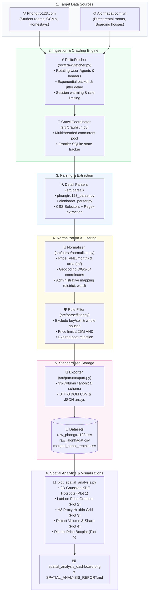

# Vietnam Rental Room: Web Crawler, Data Engineering & Spatial Analysis Pipeline

> **Branch:** `feature/crawler-phongtro123-alonhadat`  
> **Target Platforms:** [Phongtro123.com](https://phongtro123.com) & [Alonhadat.com.vn](https://alonhadat.com.vn)  
> **Target Markets:** Hanoi & Ho Chi Minh City  
> **Outputs:** 33-Column Standardized CSV (UTF-8 BOM), JSON, and 5-Panel Spatial Analysis Visualizations  

---

## 1. Overview & Architecture

This repository delivers an end-to-end data pipeline designed to collect, clean, standardize, and spatially analyze rental room listings (*phòng trọ*, *chung cư mini / CCMN*, *studio*, *ở ghép*, *căn hộ dịch vụ*) across major Vietnamese metropolitan areas.




---

## 2. Key Modules & Directory Structure

```text
.
├── config/
│   └── sources.yaml                # Site URLs, category patterns, rate limits, headers
├── docs/
│   └── PLAN.md                     # Technical requirements & milestone specifications
├── scripts/
│   └── crawl_all.py                # Main CLI entrypoint for batch multi-site crawling
├── src/
│   ├── crawl/
│   │   ├── fetcher.py              # HTTP client with rate-limiting & exponential backoff
│   │   └── run.py                  # Concurrent crawl coordinator & discovery queue
│   └── parse/
│       ├── alonhadat_parser.py     # HTML parser for Alonhadat.com.vn
│       ├── phongtro123_parser.py   # HTML parser for Phongtro123.com
│       ├── normalizer.py           # Price, area, geocoding & address normalization
│       ├── filter.py               # Outlier, expired listing & irrelevant property filter
│       └── export.py               # Canonical 33-column CSV/JSON exporter
├── tests/
│   └── test_parsers.py             # Unit tests for parsers, regex & normalizers
├── plot_spatial_analysis.py        # 5-panel spatial dashboard generator
├── PHONGTRO123_CRAWLING_REPORT.md  # Detailed technical crawling report
├── SPATIAL_ANALYSIS_REPORT.md      # Spatial economics & market insights report
└── requirements.txt                # Python environment dependencies
```

---

## 3. Canonical Data Schema (33 Columns)

Every listing extracted from all platforms is mapped to the canonical schema:

| Column | Data Type | Description & Example |
| :--- | :--- | :--- |
| `listing_id` | `string` | Unique identifier (e.g. `phongtro123_712549`, `alonhadat_19042998`) |
| `source` | `string` | Origin platform (`phongtro123`, `alonhadat`) |
| `url` | `string` | Canonical link to listing post |
| `title` | `string` | Post headline |
| `description` | `string` | Full textual description |
| `price_vnd` | `integer / null` | Monthly rental price in VND (e.g. `4500000`) |
| `area_m2` | `float / null` | Floor surface area in square meters (e.g. `28.5`) |
| `address_raw` | `string` | Original raw address string |
| `city` | `string` | Standardized city identifier (`hanoi`, `hcm`) |
| `district` | `string` | Standardized district name (e.g. `Cầu Giấy`, `Nam Từ Liêm`) |
| `ward` | `string` | Standardized ward/commune name (e.g. `Dịch Vọng Hậu`) |
| `house_type` | `string` | Property classification (`CCMN`, `Studio khép kín`, `Phòng trọ khép kín`...) |
| `latitude` | `float` | WGS-84 latitude coordinate |
| `longitude` | `float` | WGS-84 longitude coordinate |
| `electric_price` | `string` | Stated electricity rate |
| `water_price` | `string` | Stated water tariff |
| `wifi_price` | `string` | Internet / WiFi fee |
| `other_utilities_price`| `string` | General service / building maintenance charges |
| `parking_fee` | `string` | Stated vehicle parking fee |
| `air_conditioner` | `boolean` | Air conditioning availability (`True` / `False`) |
| `water_heater` | `boolean` | Hot water heater availability (`True` / `False`) |
| `refrigerator` | `boolean` | Refrigerator included (`True` / `False`) |
| `washing_machine` | `boolean` | Washing machine access (`True` / `False`) |
| `elevator` | `boolean` | Building elevator access (`True` / `False`) |
| `balcony_window` | `boolean` | Private balcony or exterior window (`True` / `False`) |
| `fire_safety` | `boolean` | Fire prevention & ladder compliance mentions |
| `pet_allowed` | `boolean` | Pet-friendly flag (`True` / `False`) |
| `room_type` | `string` | Target classification category (`phòng trọ`) |
| `posted_at_raw` | `string` | Original timestamp string from the website |
| `phone_number` | `string` | Extracted contact telephone number |
| `image_urls` | `string (JSON)`| List of high-resolution property image URLs |
| `n_images` | `integer` | Total number of extracted photo assets |
| `crawled_at` | `string (ISO)` | Crawl ingestion timestamp |

---

## 4. Quickstart Guide

### Prerequisites
* Python 3.9+
* Recommended: Virtual environment (`venv` or `conda`)

```bash
# Clone the repository and switch to the feature branch
git checkout feature/crawler-phongtro123-alonhadat

# Install dependencies
pip install -r requirements.txt
```

### 1. Run Unit Tests
Verify parsing rules, extraction regexes, and data cleaners:
```bash
python3 -m unittest discover -s tests -p "test_*.py"
```

### 2. Run Crawler
Execute multi-site batch crawling with CLI options:
```bash
# Crawl all enabled sources for Hanoi (default: 5 pages per category)
python3 scripts/crawl_all.py --site all --city hanoi

# Crawl specific site with custom pagination
python3 scripts/crawl_all.py --site phongtro123 --city hanoi --max-pages 10

# Crawl full dataset including negotiable prices
python3 scripts/crawl_all.py --site alonhadat --city hanoi --max-pages 0 --allow-negotiable
```

### 3. Generate Spatial Analysis Dashboard
Generate the 300 DPI 5-plot visualization dashboard:
```bash
python3 plot_spatial_analysis.py
```
Output artifact: `spatial_analysis_dashboard.png`.

---

## 5. Spatial Analytics & Reporting
Detailed technical documentation and market findings are available in:
* **[SPATIAL_ANALYSIS_REPORT.md](SPATIAL_ANALYSIS_REPORT.md)**: Spatial economics, 2D Gaussian KDE hotspot modeling, H3 proxy hexagonal binning, and district-level price dispersion.
* **[PHONGTRO123_CRAWLING_REPORT.md](PHONGTRO123_CRAWLING_REPORT.md)**: Crawler reverse engineering, DOM structure analysis, and pagination limit discoveries.
