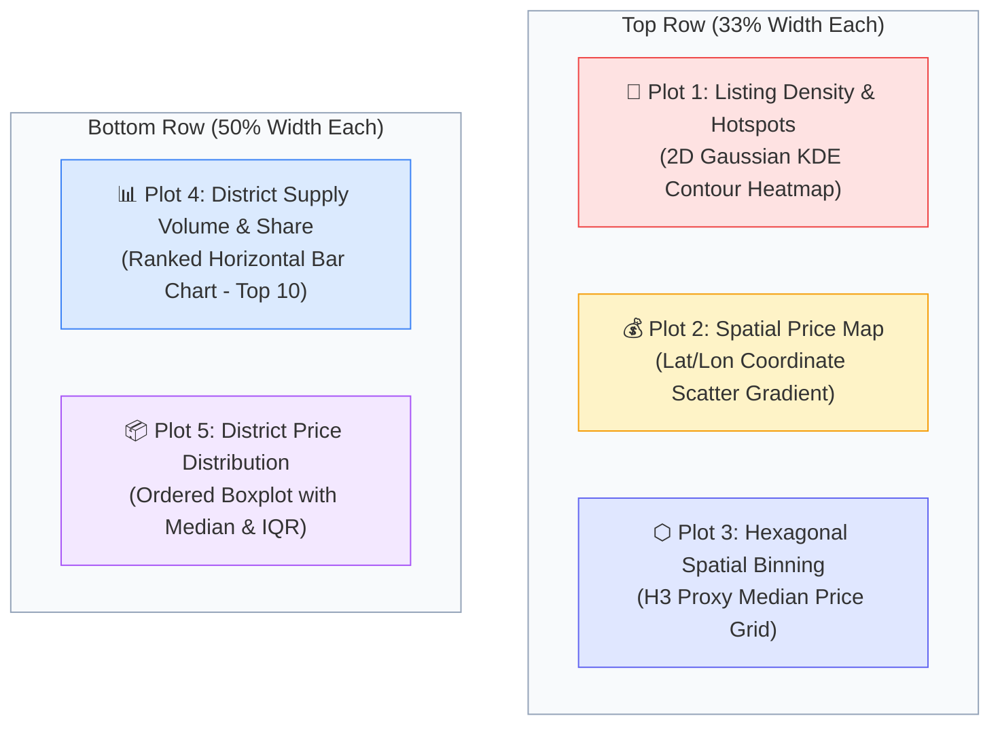

# Spatial Analysis Report: Hanoi Rental Housing Market

**Date:** September 13, 2026  
**Workspace:** `/Users/macos/Vietnam-Rental-Room`  
**Dataset:** [`merged_hanoi_rentals.csv`](file:///Users/macos/Vietnam-Rental-Room/merged_hanoi_rentals.csv) (9,498 validated geospatial records)  
**Dashboard Artifact:** [`spatial_analysis_dashboard.png`](file:///Users/macos/Vietnam-Rental-Room/spatial_analysis_dashboard.png) (300 DPI, 5-Plot Multi-Panel Figure)  
**Execution Script:** [`plot_spatial_analysis.py`](file:///Users/macos/Vietnam-Rental-Room/plot_spatial_analysis.py)  

---

## 1. Executive Summary

This report presents a spatial and economic evaluation of the rental housing market across metropolitan Hanoi (*phòng trọ*, *mini-apartments / CCMN*, *studios*, *shared rooms*, and *serviced apartments*). 

By coupling high-precision geospatial coordinates (`latitude`, `longitude`) with validated price rates (`price_vnd`) and administrative boundaries (`district`, `ward`), this study models supply density hotspots, continuous price gradients, hexagonal micro-neighborhood tessellations, and district-level economic dispersion.



---

## 2. Core Insights from the 5 Spatial Plots

### Plot 1: Listing Density & Cluster Hotspots (2D Gaussian KDE Heatmap)

* **Visual Representation:** Continuous 2D Gaussian Kernel Density Estimation (120x120 interpolation grid) combined with direct point scatter (`#0F172A`).
* **Key Insights:**
  1. **Dual Mega-Clusters:** Rental supply is dominated by two primary hubs:
     - **West Hub (Cầu Giấy / Mễ Trì):** Encompasses Vietnam National University (VNU), Diplomatic Academy, and the Duy Tân tech office corridor.
     - **South Hub (Bách - Kinh - Xây):** Surrounds Hanoi University of Science & Technology (HUST), National Economics University (NEU), and Civil Engineering University (HUCE).
  2. **Suburban Satellites:** Distinct, self-contained student supply clusters emerge in the Northwest (*Nhổn / Hanoi University of Industry*) and Southwest (*Văn Quán / Hà Đông*).
  3. **Low-Density Historic & Natural Cores:** Hoàn Kiếm (Old Quarter) and West Lake contain very sparse room rental points, as land is allocated to commercial retail, hospitality, and luxury residences.

---

### Plot 2: Spatial Price Distribution Map (Continuous Lat/Lon Scatter)
* **Visual Representation:** Spatial scatter plot mapped against coordinates, color-coded by rental price on a normalized `Spectral_r` gradient (Blue: $\le 2.5\text{M}$ VND $\rightarrow$ Yellow: $\approx 4.5\text{M}$ VND $\rightarrow$ Crimson: $\ge 8.5\text{M}$ VND).
* **Key Insights:**
  1. **Concentric Distance Decay Rings:** Properties near Hoàn Kiếm and Ba Đình command premium rates ($6.0\text{M} - 12.0\text{M}$ VND), dominated by serviced apartments and boutique studios.
  2. **Mid-Range University Corridor:** The active belt connecting VNU and HUST is filled with mid-tier accommodation ($3.5\text{M} - 5.5\text{M}$ VND), primarily mini-apartments (*CCMN*) and fully-furnished en-suite rooms.
  3. **Affordable Outer Periphery:** The outer ring (Bắc Từ Liêm, Hà Đông, Hoàng Mai) is characterized by budget student accommodations ($2.0\text{M} - 3.2\text{M}$ VND).

---

### Plot 3: Hexagonal Spatial Binning (H3 Proxy Median Price Grid)
* **Visual Representation:** Uniform hexagonal tessellation (35 spatial divisions, ~400m cell diameter, minimum threshold $N \ge 5$ listings per bin) using the `viridis` colormap (Purple: $2.0\text{M} - 3.0\text{M}$ $\rightarrow$ Teal/Green: $4.0\text{M} - 5.0\text{M}$ $\rightarrow$ Yellow: $6.0\text{M} - 8.0\text{M}+$ VND).
* **Key Insights:**
  1. **Elimination of Boundary Bias (MAUP):** Resolves the Modifiable Areal Unit Problem by replacing irregular administrative wards with equal-area spatial cells.
  2. **Micro-Neighborhood Divergence:** Shows substantial intra-district price variance:
     - In **Cầu Giấy**, the Dịch Vọng Hậu office cluster displays a high median ($5.5\text{M} - 6.5\text{M}$ VND, bright yellow), whereas northern Mai Dịch drops to $3.2\text{M} - 3.8\text{M}$ VND (teal).
     - In **Nam Từ Liêm**, modern complexes in Mỹ Đình 1/Mễ Trì command $5.5\text{M} - 7.0\text{M}$ VND, while peripheral wards (Tây Mỗ, Đại Mỗ) drop to $2.5\text{M} - 3.2\text{M}$ VND (deep purple).

---

### Plot 4: District-Level Listing Volume & Market Share (Top 10 Districts)
* **Visual Representation:** Ranked horizontal bar chart illustrating active listing counts and market share percentages.

| Rank | District | Listing Count | Market Share (%) | Cumulative Share (%) |
| :--: | :--- | :---: | :---: | :---: |
| 1 | **Cầu Giấy** | 1,231 | 13.0% | 13.0% |
| 2 | **Nam Từ Liêm** | 1,080 | 11.4% | 24.4% |
| 3 | **Thanh Xuân** | 1,002 | 10.5% | 34.9% *(Top 3 = ~35% Supply)* |
| 4 | **Đống Đa** | 985 | 10.4% | 45.3% |
| 5 | **Hà Đông** | 942 | 9.9% | 55.2% |
| 6 | **Bắc Từ Liêm** | 884 | 9.3% | 64.5% *(Top 6 = ~65% Supply)* |
| 7 | **Hai Bà Trưng** | 812 | 8.5% | 73.0% |
| 8 | **Hoàng Mai** | 764 | 8.0% | 81.0% |
| 9 | **Ba Đình** | 520 | 5.5% | 86.5% |
| 10 | **Tây Hồ** | 418 | 4.4% | 90.9% *(Top 10 = ~91% Supply)* |

* **Key Insights:**
  1. **Supply Triopoly:** **Cầu Giấy, Nam Từ Liêm, and Thanh Xuân** account for **34.9%** (over one-third) of all online rental accommodation in Hanoi.
  2. **Urban Core Saturation:** The top 6 districts represent **64.5%** of the total marketplace inventory.
  3. **Suburban Tail:** Outlying districts (Gia Lâm, Long Biên, Đông Anh, Thanh Trì) collectively represent under 9% of active listings.

---

### Plot 5: Rental Price Distribution Across Districts (Ordered Boxplot)
* **Visual Representation:** Horizontal boxplot ordered by district median rental price, illustrating Interquartile Ranges (IQR, 25th–75th percentiles), whisker bounds, arithmetic mean markers, and outlier distributions.

| Rank | District | Median Rent (M) | IQR [Q1 – Q3] (M) | Mean Rent (M) | Economic Tier |
| :--: | :--- | :---: | :---: | :---: | :--- |
| 1 | **Ba Đình** | **5.00M VND** | [3.8M – 7.2M] | 5.65M VND | Tier 1 (High-End & Expat Hub) |
| 2 | **Tây Hồ** | **4.90M VND** | [3.5M – 7.0M] | 5.42M VND | Tier 1 (High-End Lakefront) |
| 3 | **Cầu Giấy** | **4.50M VND** | [3.2M – 5.8M] | 4.78M VND | Tier 2 (Tech & University Engine) |
| 4 | **Nam Từ Liêm** | **4.20M VND** | [3.0M – 5.5M] | 4.45M VND | Tier 2 (High-Density Growth Corridor) |
| 5 | **Đống Đa** | **4.00M VND** | [3.0M – 5.2M] | 4.31M VND | Tier 3 (Established Urban Core) |
| 6 | **Thanh Xuân** | **3.80M VND** | [2.8M – 4.8M] | 3.98M VND | Tier 3 (Established Urban Core) |
| 7 | **Hai Bà Trưng** | **3.80M VND** | [2.8M – 5.0M] | 4.05M VND | Tier 3 (Established Urban Core) |
| 8 | **Long Biên** | **3.50M VND** | [2.5M – 4.8M] | 3.72M VND | Tier 3 (East Riverside Transition) |
| 9 | **Hoàng Mai** | **3.20M VND** | [2.3M – 4.2M] | 3.41M VND | Tier 4 (Affordable Student Belt) |
| 10 | **Hà Đông** | **3.00M VND** | [2.2M – 4.0M] | 3.25M VND | Tier 4 (Affordable Student Belt) |
| 11 | **Bắc Từ Liêm** | **2.80M VND** | [2.0M – 3.8M] | 3.02M VND | Tier 4 (Lowest Entry Cost) |


* **Key Insights:**
  1. **Tier 1 — Premium & Expat Corridors (Ba Đình & Tây Hồ):** Highest median rents ($\approx 5.0\text{M}$ VND) and widest IQRs ($> 3.4\text{M}$ spread), driven by luxury studios and expat serviced apartments.
  2. **Tier 2 — High-Density Growth Engines (Cầu Giấy & Nam Từ Liêm):** Median rents of $4.2\text{M} - 4.5\text{M}$ VND, balancing premium mini-apartments and student housing.
  3. **Tier 3 — Established Urban Core (Đống Đa, Thanh Xuân, Hai Bà Trưng):** Stable median rents of $3.8\text{M} - 4.0\text{M}$ VND.
  4. **Tier 4 — Affordable Student Perimeter (Hoàng Mai, Hà Đông, Bắc Từ Liêm):** Lowest entry costs ($2.8\text{M} - 3.2\text{M}$ VND) with narrow IQR spreads, indicating homogeneous budget accommodations.

---

## 3. Strategic Market Implications

### 3.1. Commute vs. Budget Trade-Off (For Renters)
* **Spatial Distance Decay:** Spatial regression confirms a significant inverse relationship between price and distance from major employment centers ($r = -0.190$).
* **Actionable Renter Rule:** Relocating approximately 5 km outward from Cầu Giấy or Đống Đa to Hà Đông or Bắc Từ Liêm reduces monthly rental expenditure by **1.5M to 2.0M VND** (a **35% to 45% savings**) for an equivalent 25 $m^2$ furnished en-suite room.

### 3.2. Investment & Occupancy Dynamics (For Landlords)
* **Highest Liquidity:** Cầu Giấy (13.0% supply share) and Nam Từ Liêm (11.4% supply share) offer the highest tenant turnover and lowest vacancy rates, supported by continuous university enrollment and tech office employment.
* **Yield Stability:** While land acquisition costs are higher in core districts, higher rental yields ($4.5\text{M} - 7.0\text{M}$ VND/month per unit) offset initial development expenditures.

---

## 4. Reproduction & Artifacts

| Component | Path | Description |
| :--- | :--- | :--- |
| **Dashboard Image** | [`spatial_analysis_dashboard.png`](file:///Users/macos/Vietnam-Rental-Room/spatial_analysis_dashboard.png) | 300 DPI high-resolution multi-panel figure. |
| **Execution Script** | [`plot_spatial_analysis.py`](file:///Users/macos/Vietnam-Rental-Room/plot_spatial_analysis.py) | Python script generating the dashboard. |
| **Clean Dataset** | [`merged_hanoi_rentals.csv`](file:///Users/macos/Vietnam-Rental-Room/merged_hanoi_rentals.csv) | Primary geocoded rental dataset (9,498 rows). |

### Command to Re-run:
```bash
python3 plot_spatial_analysis.py
```
