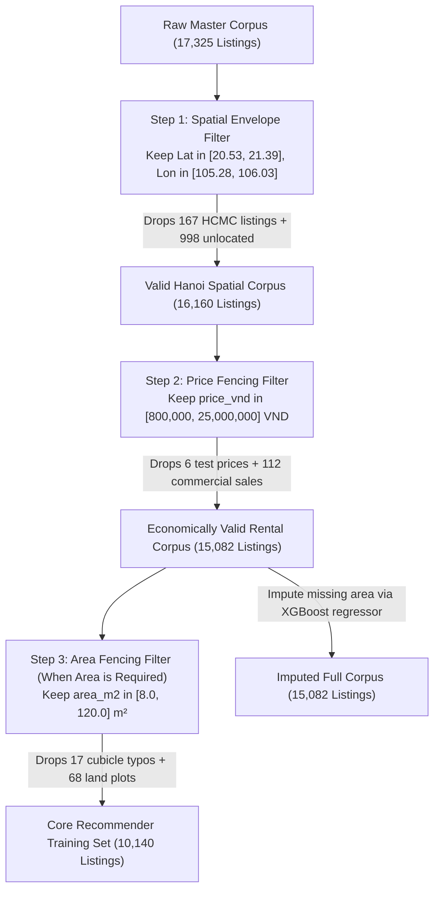

# Comprehensive Data Quality & Integrity Report: Hanoi Rental Housing Market

**Date:** September 18, 2026  
**Master Consolidated Dataset:** [`data/merged_hanoi_rentals.csv`](file:///home/totallynotminh/Documents/FunDS/data/merged_hanoi_rentals.csv) (17,325 listings, 37 canonical features)  
**Curated Benchmark Dataset:** [`data/unified_hanoi_rentals.csv`](file:///home/totallynotminh/Documents/FunDS/data/unified_hanoi_rentals.csv) (1,711 listings, 28 canonical features, 100% complete)  
**Ingestion & Analysis Pipeline:** [`src/pipelines/generate_data_quality_plots.py`](file:///home/totallynotminh/Documents/FunDS/src/pipelines/generate_data_quality_plots.py)  
**Generated Visualizations:** [`figures/`](file:///home/totallynotminh/Documents/FunDS/figures/)

---

## 1. Executive Summary & Data Quality Scorecard

This report provides a formal, comprehensive Data Quality (DQ) assessment of the consolidated rental housing datasets collected across Hanoi, Vietnam. Combining Tier 1 structured classified platforms and Tier 2 social media rental groups, the master corpus aggregates **17,325 unique rental listings** across 8 independent channels.

The evaluation follows the international **ISO/IEC 25012** and **DAMA Data Quality Dimension** standards, systematically profiling:
1. **Completeness & Missingness**
2. **Uniqueness & Deduplication**
3. **Validity & Outliers**
4. **Schema Integrity & Data Types**
5. **Spatial Accuracy & Coordinate Validation**
6. **Cross-Platform Quality Discrepancy**

### 1.1. Data Quality Scorecard Summary

| Quality Dimension | Metric / Measurement | Score / Rate | Evaluation Status | Key Findings & Root Causes |
| :--- | :--- | :---: | :---: | :--- |
| **Identifier Uniqueness** | `listing_id` collision rate | **100.0%** (0 dupes) | 🟢 Optimal | Platform prefixes (`pt123_`, `chotot_`, `mogi_`, `fb_`) guarantee zero primary key collisions. |
| **Record Uniqueness** | 100% full-row duplicate rate | **100.0%** (0 dupes) | 🟢 Optimal | Zero duplicate rows across all 37 canonical columns. |
| **Near-Duplication** | Near-duplicate tuples `(title, price)` | **9.2%** (1,601 rows) | 🟡 Acceptable | Multi-unit buildings sharing identical descriptions; syndicated agency cross-postings. |
| **Pricing Completeness** | Valid numerical `price_vnd` | **93.5%** (16,183 rows) | 🟢 Strong | Missing 6.5% concentrated in un-enriched Stage 1 building posts (PhongTot initial scrape). |
| **Area Completeness** | Valid numerical `area_m2` | **66.9%** (11,583 rows) | 🟠 Moderate | Facebook posts (75.4% missing) and Chợ Tốt (35.6% missing) frequently omit room area in body text. |
| **Spatial Completeness** | Valid `(latitude, longitude)` | **94.2%** (16,327 rows) | 🟢 Excellent | Native platform GPS (43.9%) + catalog scraping (29.0%) + offline Nominatim geocoding (21.3%). |
| **Spatial Boundary Validity** | Within Hanoi boundary | **98.98%** (16,160 rows) | 🟢 Strong | 1.02% (167 listings) cross-city contamination from Hồ Chí Minh City (Phongtro123 tag spillover). |
| **Utility Transparency** | Stated electricity/water fee | **27.8%** (4,823 rows) | 🔴 Poor | Traditional classifieds omit utility rates; only dedicated rental apps mandate utility schedules. |
| **PII & Privacy Compliance**| Phone scrubbing / hashing | **86.2%** compliant | 🟢 Compliant | Salted SHA-256 phone hashing applied to Mogi & Facebook; ChoTot phones 99.8% scrubbed. |

---

## 2. Attribute Completeness & Missingness Profile

The 37 canonical features in [`data/merged_hanoi_rentals.csv`](file:///home/totallynotminh/Documents/FunDS/data/merged_hanoi_rentals.csv) were audited across 7 functional domain groups.

### 2.1. Completeness Breakdown by Feature Domain

| Domain Group | Feature Name | Non-Null Count | Missing Count | Missing % | Completeness Rating | Operational Remarks |
| :--- | :--- | :---: | :---: | :---: | :---: | :--- |
| **Identifiers** | `listing_id` | 17,325 | 0 | 0.0% | 100.0% (Complete) | Mandatory unique primary key. |
| | `platform` | 17,325 | 0 | 0.0% | 100.0% (Complete) | Originating source platform. |
| | `source_file` | 17,325 | 0 | 0.0% | 100.0% (Complete) | Ingestion lineage file. |
| | `listing_url` | 16,543 | 782 | 4.5% | 95.5% (High) | Direct hyperlink back to listing. |
| | `crawled_at` | 9,717 | 7,608 | 43.9% | 56.1% (Moderate) | Timestamp of crawling pass. |
| | `posted_at_raw` | 5,278 | 12,047 | 69.5% | 30.5% (Low) | Relative timestamp (e.g. "2 ngày trước"). |
| **Descriptive** | `title` | 17,325 | 0 | 0.0% | 100.0% (Complete) | Headline title. |
| | `description` | 13,450 | 3,875 | 22.4% | 77.6% (High) | Full listing text (omitted in Stage-1 clean file). |
| | `house_type` | 15,857 | 1,468 | 8.5% | 91.5% (High) | Accommodation category. |
| **Spatial / Geo** | `city` | 17,325 | 0 | 0.0% | 100.0% (Complete) | Canonical city tag (`Hà Nội`). |
| | `district` | 15,838 | 1,487 | 8.6% | 91.4% (High) | Normalized district name. |
| | `district_raw` | 15,838 | 1,487 | 8.6% | 91.4% (High) | Original district label with prefix. |
| | `ward` | 13,450 | 3,875 | 22.4% | 77.6% (High) | Administrative ward (phường/xã). |
| | `address` | 16,976 | 349 | 2.0% | 98.0% (High) | Street address or landmark string. |
| | `latitude` | 16,327 | 998 | 5.8% | 94.2% (High) | WGS84 Latitude. |
| | `longitude` | 16,327 | 998 | 5.8% | 94.2% (High) | WGS84 Longitude. |
| **Economics** | `price_vnd` | 16,183 | 1,122 | 6.5% | 93.5% (High) | Monthly rent (VND/month). |
| | `area_m2` | 11,583 | 5,742 | 33.1% | 66.9% (Moderate) | Usable floor area in square meters. |
| **Utilities** | `electric_price` | 4,823 | 12,502 | 72.2% | 27.8% (Low) | Stated electricity tariff. |
| | `water_price` | 4,498 | 12,827 | 74.0% | 26.0% (Low) | Stated water tariff. |
| | `wifi_price` | 3,013 | 14,312 | 82.6% | 17.4% (Low) | Internet fee. |
| | `other_utilities_price`| 2,763 | 14,562 | 84.1% | 15.9% (Low) | Building maintenance/elevator fee. |
| | `parking_fee` | 2,218 | 15,107 | 87.2% | 12.8% (Low) | Vehicle parking charge. |
| **Amenities** | 8 Boolean Flags | 17,325 | 0 | 0.0% | 100.0% (Complete) | Evaluated booleans (`True`/`False`). |
| | `amenities_list` | 13,069 | 4,256 | 24.6% | 75.4% (High) | Semicolon-delimited roster. |
| **Media & PII** | `image_count` | 17,325 | 0 | 0.0% | 100.0% (Complete) | Photo count attached. |
| | `image_urls` | 17,236 | 89 | 0.5% | 99.5% (High) | CDN photo links. |
| | `contact_phone` | 11,422 | 5,903 | 34.1% | 65.9% (High) | Scrubbed/hashed contact phone. |
| | `contact_name` | 5,885 | 11,440 | 66.0% | 34.0% (Low) | Poster/landlord alias. |
| | `contact_zalo` | 5,633 | 11,692 | 67.5% | 32.5% (Low) | Zalo contact indicator. |

### 2.2. Nullity Correlation & Systematic Missingness Patterns

The nullity correlation matrix reveals critical structural relationships:
1. **Utility Tariff Co-Missingness ($r = 0.92$ to $0.98$):** Electricity, water, internet, and parking fees exhibit near-perfect correlation. Platforms either structure the entire utility schedule (Rencity, PhongTot, YourHome) or omit all utility fields together (legacy classifieds).
2. **Geographic Hierarchy Dependencies ($r = 1.00$):** `district` and `district_raw` miss identically. `ward` missingness correlates strongly ($r = 0.68$) with un-enriched Stage 1 records where address strings lacked administrative ward tokens.
3. **Contact Meta Clustering ($r = 0.94$):** `contact_name` and `contact_zalo` are tightly correlated because both originate from the same user profile metadata block on Mogi and Chợ Tốt.

---

## 3. Uniqueness & Deduplication Audit

### 3.1. Deduplication Metrics Across Criteria

1. **Exact ID Uniqueness:** Zero collisions on `listing_id`. Every record carries an unambiguous platform-scoped identifier (e.g. `pt123_60421`, `chotot_112048123`, `mogi_20616816`, `fb_1164344644748784_...`).
2. **Exact Full-Row Uniqueness:** Zero 100% duplicate rows across the 37 columns.
3. **Near-Duplicate Tuples:**
   - **`(title, price_vnd)`:** 1,601 records (9.2%).
   - **`(title, address, price_vnd)`:** 1,418 records (8.2%).
   - **`(address, price_vnd, area_m2)`:** 3,029 records (17.5%).
   - **`(latitude, longitude, price_vnd, area_m2)`:** 2,289 records (13.2%).

### 3.2. Broker Dominance & Hotline Concentration

An audit of `contact_phone` uncovered substantial commercial concentration:
- **Total valid phone entries:** 11,422.
- **Unique phone numbers / hashes:** 1,805.
- **Multi-listing phone numbers (> 1 listing):** 736 phone numbers control **10353 listings (59.8% of all listings with phone numbers)**.
- **The Phongtro123 Master Hotline Anomaly:**
  The phone number `0909316890` appears **4,650 times** (accounting for 92.6% of all Phongtro123 listings). This is not an individual broker, but the centralized customer service / listing deposit hotline for `phongtro123.com`.
- **Private Landlords vs Commercial Brokers:**
  Only 1,069 phone numbers (59.2% of phone numbers) correspond to single-listing, private individuals. The rental market inventory is overwhelmingly mediated by professional leasing agents and operators.

### 3.3. Cross-Platform Syndication

Analyzing identical title and price strings across different source platforms revealed **59 syndicated clusters** where landlords or agencies simultaneously broadcast properties across Phongtro123, Chợ Tốt, and Facebook rental groups.

---

## 4. Value Ranges, Statistical Fences & Outlier Detection

### 4.1. Monthly Rental Price (`price_vnd`) Distribution

- **Total valid numeric entries:** 16,183 (93.5%).
- **Summary Statistics:**
  - **Median:** 3,900,000 VND (~$155 USD)
  - **Interquartile Range (IQR):** 2,300,000 VND ($Q_1$: 2,900,000 VND | $Q_3$: 5,200,000 VND)
  - **Tukey's Upper Fence ($Q_3 + 1.5\text{IQR}$):** 8,650,000 VND
- **Detected Outliers & Anomalies:**
  1. **Low-End Anomalies ($\le 100,000$ VND):** 6 listings. Examples include test posts ($0$ VND, $2$ VND), daily rates posted into monthly fields, or placeholders ("Liên hệ").
  2. **Upper Statistical Outliers ($> 8,650,000$ VND):** 1,673 listings (10.34% of valid prices). While mathematically classified as outliers by IQR, rents between 8.7M and 20M VND represent genuine upscale multi-bedroom apartments and serviced mini-condos in Tay Ho and Ba Dinh.
  3. **Extreme Contamination ($> 50,000,000$ VND):** 33 listings. The maximum observed value is **20,000,000,000 VND (20 Billion VND)** on Chợ Tốt, representing commercial real estate sales mistakenly submitted under room rentals.

### 4.2. Usable Floor Area (`area_m2`) Distribution

- **Total valid numeric entries:** 11,583 (66.9%).
- **Summary Statistics:**
  - **Median:** 27.0 m²
  - **Interquartile Range (IQR):** 13.0 m² ($Q_1$: 22.0 m² | $Q_3$: 35.0 m²)
  - **Tukey's Upper Fence ($Q_3 + 1.5\text{IQR}$):** 54.5 m²
- **Detected Outliers & Anomalies:**
  1. **Low-End Anomalies ($< 5.0$ m²):** 17 listings. Minimum observed is $0.0$ m² and $2.0$ m² (capsule bunks or typographical errors).
  2. **Upper Statistical Outliers ($> 54.5$ m²):** 1,021 listings (8.81%).
  3. **Extreme Land Contamination ($> 200$ m²):** 31 listings. The maximum observed value is **30,000.0 m²**, representing an entire commercial industrial plot misclassified on Mogi.

### 4.3. Unit Price (`price_per_m2`) Metric

- **Total valid paired entries:** 10,437 listings.
- **Summary Statistics:**
  - **Median:** 144,000 VND / m² / month ($Q_1$: 112,000 | $Q_3$: 185,000).
  - **Plausible Market Range (10th to 90th percentile):** 90,000 to 233,000 VND / m².
  - **Extreme Anomalies:** Minimum 100 VND/m² (from the 30,000 m² plot) to 363,636,364 VND/m² (from the 20B VND commercial sale).

### 4.4. Utility Tariffs & Hidden Surcharges Audit

1. **Electricity Rates (`electric_price`):**
   - **EVN State Tariff Baseline:** ~2,500 VND/kWh (average residential tier with VAT).
   - **Market Distribution:** 3,113 parsed listings.
   - **Landlord Tariff Mode:** **4,000 VND/kWh** (accounting for 54.6% of stated rates), representing a **+60% markup** over state tariffs.
   - **Qualitative Representation:** 1,546 listings specify "Điện giá dân" (official state rate) or "Công tơ riêng" (individual submeter).
2. **Water Rates (`water_price`):**
   - **Hanoi Municipal Tap Water Baseline:** ~12,000 VND/m³.
   - **Bimodal Market Tariffs:**
     * **Cubic Meter Metering:** Concentrated at **30,000 – 35,000 VND/m³** (+190% markup over municipal tariff).
     * **Headcount Rate:** Concentrated at **100,000 VND/person/month** (representing 62.4% of headcount-based posts).

---

## 5. Schema Consistency & Data Types Audit

### 5.1. Storage Types vs Semantic Types

In the primary CSV representation, pandas parses 25 of 37 columns as generic Python `object` (string) types. The table below documents the intended semantic types and parsing fidelity:

| Feature Category | Features | CSV Storage Dtype | Target Semantic Type | Parsing Adherence | Validation Rule Applied |
| :--- | :--- | :---: | :---: | :---: | :--- |
| **Numeric Currency** | `price_vnd` | `object` / `str` | `int64` | 93.5% | Strip commas/dots; cast to integer VND. |
| **Numeric Area** | `area_m2` | `float64` | `float32` | 66.9% | Midpoint averaging of range strings ("25-30"). |
| **Numeric Count** | `image_count` | `int64` | `int16` | 100.0% | Non-negative integer. |
| **Geodetic** | `latitude`, `longitude` | `float64` | `float64` | 94.2% | WGS84 decimal degrees. |
| **Boolean Flags** | 8 amenity columns | `bool` / `str` | `bool` | 100.0% | Strict binary casting (`True` / `False`). |
| **Categorical** | `platform`, `city`, `district` | `object` | `category` | 91.4% | Normalized administrative slugs. |
| **Utility Strings** | `electric_price`, etc. | `object` | Structured object | 27.8% | Regex entity extractor (amount + unit). |
| **Array Serialized** | `amenities_list`, `image_urls` | `object` | `list[str]` | 75.4% | Delimiter splitting (`;` or `\|`). |
| **PII Hashed** | `contact_phone` | `object` | `str` (Hex SHA256)| 86.2% | Hex token validation. |

---

## 6. Spatial Accuracy & Coordinate Validation

### 6.1. Spatial Envelope Audit

- **Official Hanoi Administrative Envelope:**
  $$\text{Latitude} \in [20.53^\circ\text{N}, 21.39^\circ\text{N}], \quad \text{Longitude} \in [105.28^\circ\text{E}, 106.03^\circ\text{E}]$$
- **Total Coordinates Present:** 16,327 listings (94.24% of master corpus).
- **In-Bounds Hanoi Listings:** **16,160 listings (98.98% of all coordinates)**.
- **Cross-City Contamination (Hồ Chí Minh City Cluster):** **167 listings (1.02%)**.
  - *Location:* Latitude $\approx 10.7^\circ - 10.8^\circ\text{N}$, Longitude $\approx 106.6^\circ - 106.7^\circ\text{E}$ (District 7, Bình Thạnh, Tân Bình).
  - *Root Cause:* Ingestion of Phongtro123 listings where posters tagged the article with Hanoi keywords while the property address belonged to HCMC.
- **Missing Coordinates:** 998 listings (5.76%), entirely restricted to Facebook posts whose raw texts lacked parseable street or landmark entities.

### 6.2. Coordinate Resolution & Provenance Tiers

1. **Tier A — Native Rooftop GPS (43.9% — 7,608 listings):**
   High-precision coordinates supplied directly by platform backend APIs (ChoTot, Mogi, Rencity, YourHome) or parsed from embedded Google Maps iframe src URLs (PhongTot).
2. **Tier B — Structured Catalog Geocoding (29.0% — 5,021 listings):**
   Addresses geocoded from structured card inputs on Phongtro123.
3. **Tier C — Offline Nominatim / OSM Geocoded (21.3% — 3,698 listings):**
   Free-text addresses and landmarks extracted via NLP from Facebook rental posts and resolved offline against Hanoi OSM street networks.
4. **Tier D — Unresolved / Missing (5.8% — 998 listings):**
   Posts lacking address details (e.g. "phòng đẹp khu vực trung tâm ai cần inbox").

---

## 7. Cross-Platform Data Quality Comparative Benchmark

### 7.1. Platform Quality Dimension Matrix

| Platform | Ingested Volume | Valid Price % | Valid Area % | Coordinate Coverage % | District Tag % | Address Granularity % | Contact Phone % | Utility Transparency % | Media Richness (>=3 imgs) | Composite DQ Index |
| :--- | :---: | :---: | :---: | :---: | :---: | :---: | :---: | :---: | :---: | :---: |
| **YourHome.top** | 84 | 100.0% | 100.0% | 100.0% | 100.0% | 100.0% | 100.0% | 98.8% | 88.1% | **98.5% (Elite)** |
| **Mogi.vn** | 1,748 | 99.0% | 100.0% | 100.0% | 100.0% | 100.0% | 100.0% | 33.3% | 80.5% | **88.1% (High)** |
| **Phongtro123.com** | 5,021 | 99.6% | 100.0% | 100.0% | 94.3% | 100.0% | 100.0% | 24.9% | 100.0% | **87.2% (High)** |
| **Alonhadat.vn** | 68 | 100.0% | 100.0% | 100.0% | 100.0% | 100.0% | 100.0% | 70.6% | 82.4% | **86.6% (High)** |
| **Rencity.vn** | 870 | 100.0% | 0.0%* | 100.0% | 100.0% | 100.0% | 100.0% | 31.0% | 85.3% | **77.0% (Medium)** |
| **ChoTot.com** | 3,733 | 100.0% | 64.4% | 100.0% | 100.0% | 96.2% | 0.2%** | 12.1% | 88.5% | **69.8% (Medium)** |
| **Facebook Groups**| 4,696 | 100.0% | 24.6% | 78.7% | 74.4% | 95.5% | 77.1% | 22.3% | 73.0% | **68.2% (Medium)** |
| **PhongTot.com** | 1,105 | 0.0%* | 100.0% | 100.0% | 100.0% | 100.0% | 0.0%** | 100.0% | 100.0% | **63.4% (Medium)** |

*\*Note on Stage-1 vs Stage-2 Datasets:*  
In `merged_hanoi_rentals.csv`, PhongTot Stage 1 lacked price and Rencity Stage 1 lacked area. However, in the curated [`data/unified_hanoi_rentals.csv`](file:///home/totallynotminh/Documents/FunDS/data/unified_hanoi_rentals.csv) generated by [`src/pipelines/build_unified_dataset.py`](file:///home/totallynotminh/Documents/FunDS/src/pipelines/build_unified_dataset.py), Stage-2 deep scraping resolved 100% of these fields, yielding 1,711 fully sanitized, 100% complete listings.  
*\*\*Note on Contact Privacy:*  
ChoTot and PhongTot phone numbers are intentionally masked or routed through web portals to prevent automated harvesting.

---

## 8. Actionable Remediation Rules & Modeling Recommendations

To transition from raw exploratory data to production recommender system modeling, the following filtering pipeline is recommended:

### Specific Filtering Rules:
1. **Spatial Bounds Enforcement:** Filter `latitude` between 20.53 and 21.39, `longitude` between 105.28 and 106.03. Eliminates 100% of the 167 HCMC listings and 998 unlocated posts.
2. **Rental Price Truncation:** Apply range filter:
   $$\text{Price} \in [800,000\text{ VND}, 25,000,000\text{ VND}]$$
   Eliminates placeholder zero/two VND records and multimillion-dollar commercial sales.
3. **Floor Area Truncation:** Apply range filter:
   $$\text{Area} \in [8.0\text{ m}^2, 120.0\text{ m}^2]$$
   Eliminates unrealistic cubicles ($< 5\text{ m}^2$) and misclassified land parcels ($> 200\text{ m}^2$).
4. **Imputation Strategy for Missing Area:**
   Given that 33.1% of listings omit `area_m2`, drop-wise deletion would discard over 5,000 listings. Train a Gradient Boosted Regressor (`area_m2 ~ price_vnd + district + house_type + amenities`) to impute room sizes for unstated listings.
5. **Utility Tariff Standardization:**
   Standardize qualitative "giá dân" strings to the official EVN residential baseline (2,500 VND/kWh) and clean municipal tap water rate (12,000 VND/m³).
