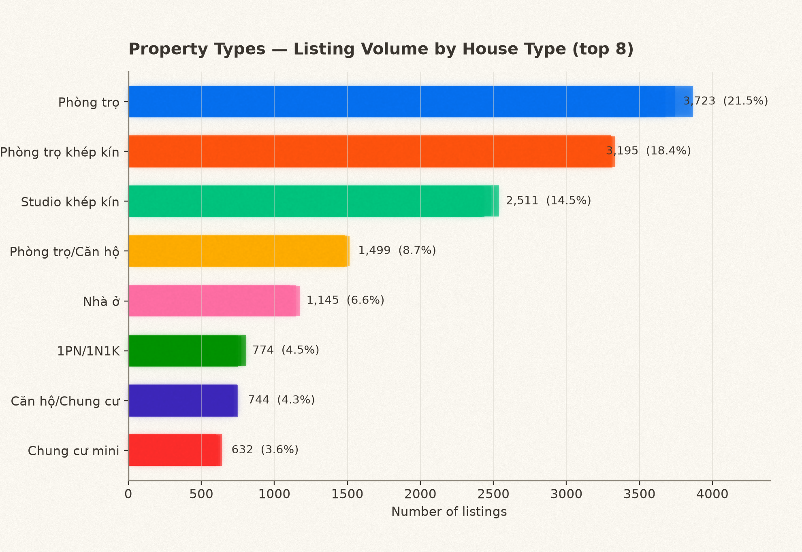
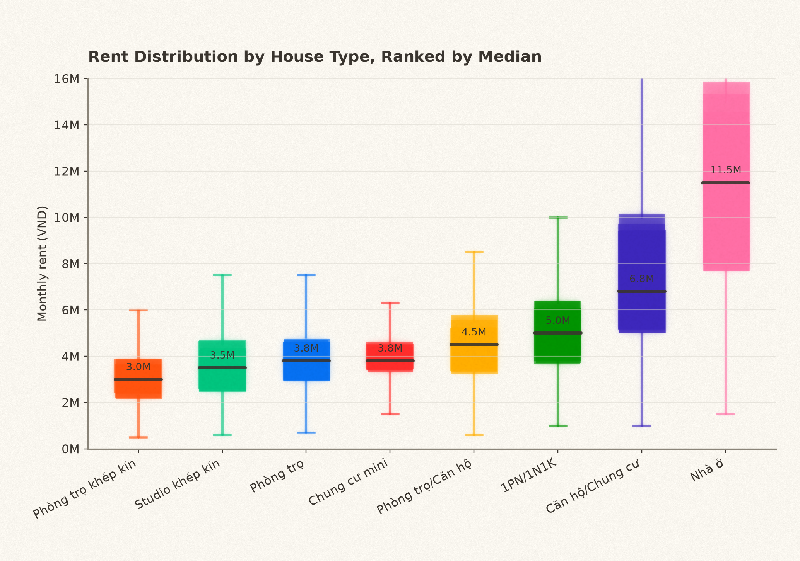
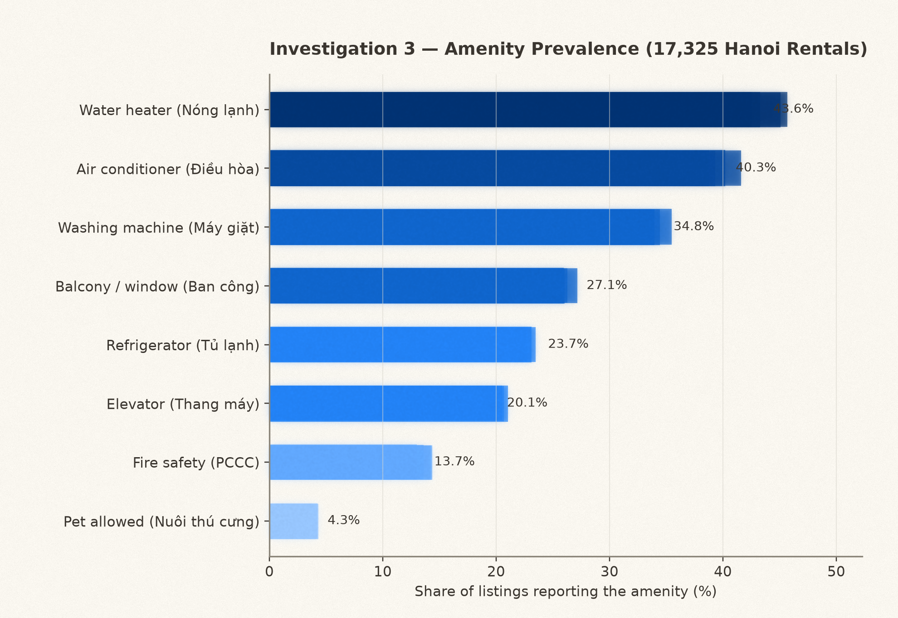
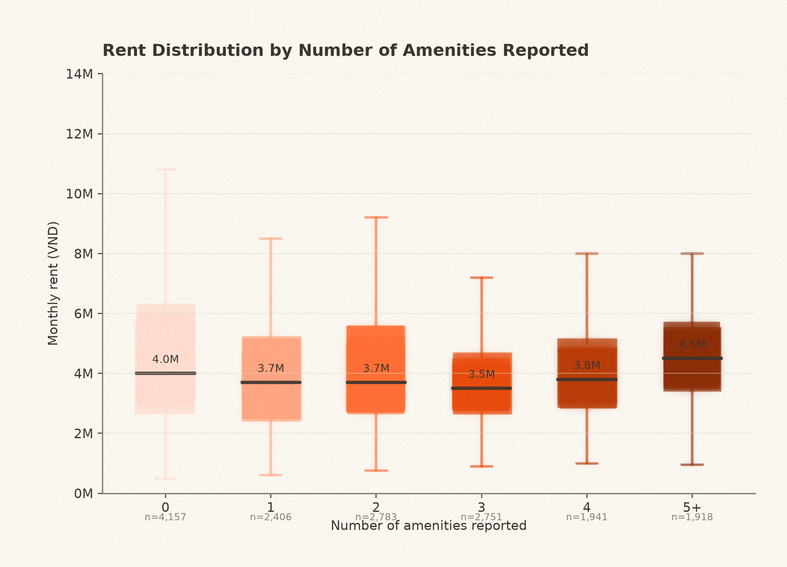
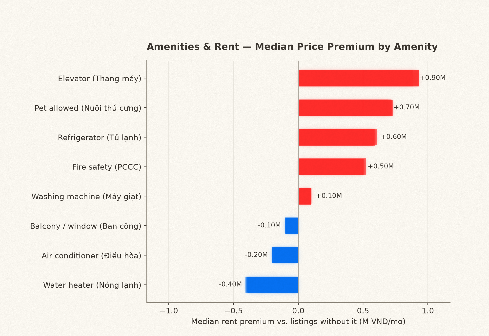

# EDA Report: Property Type & Amenities

**Dataset:** `merged_hanoi_rentals.csv` — the unified cross-source Hanoi rental corpus,
17,325 listings across 8 platforms (Phongtro123 5,021 · Facebook 4,696 · ChoTot 3,733 ·
Mogi 1,748 · PhongTot 1,105 · Rencity 870 · YourHome 84 · Alonhadat 68). Built by
`src/pipelines/merge_crawl_results.py`; see `CRAWL_AND_EDA_REPORT.md` for the full
per-platform ingestion writeup. This raw merged file is intentionally **not committed**
to the repo (see "Data & PII on disk" in `CLAUDE.md`) — this report and the figures it
references (`reports/figures/eda_watercolor/`) are the aggregate, PII-free artifacts
derived from it.

Rent figures below exclude the top/bottom ~1% of `price_vnd` (values under 500k VND or
over 30M VND/month — typos and mis-tagged property sales; see §4.2 of
`CRAWL_AND_EDA_REPORT.md`).

---

## 1. Property type composition

| House type | Listings | Share |
|---|---:|---:|
| Phòng trọ | 3,723 | 21.5% |
| Phòng trọ khép kín | 3,195 | 18.4% |
| Studio khép kín | 2,511 | 14.5% |
| Phòng trọ / Căn hộ | 1,499 | 8.7% |
| Nhà ở | 1,145 | 6.6% |
| 1 Phòng Ngủ (1PN/1N1K) | 774 | 4.5% |
| Căn hộ/Chung cư | 744 | 4.3% |
| Chung cư mini (CCMN) | 632 | 3.6% |
| Gác xép / Duplex | 512 | 3.0% |
| Nhà nguyên căn | 442 | 2.6% |
| 2 Phòng Ngủ (2PN/2N1K) | 313 | 1.8% |
| Phòng trọ WC chung | 286 | 1.7% |
| Tòa nhà căn hộ / Phòng trọ | 62 | 0.4% |
| Căn hộ dịch vụ | 19 | 0.1% |

`house_type` is 91.5% populated. Basic shared-house rooms (**Phòng trọ**, **Phòng trọ
khép kín**, **Phòng trọ WC chung**) and self-contained **Studio khép kín** units together
account for **~56%** of all inventory — this market is dominated by single-room rentals,
not apartments.

**Caveat — this taxonomy is not one canonical schema.** Each platform writes its own
`house_type` label, so counts here are a union of 14 source-specific strings rather than
a normalized set of categories (e.g. "Phòng trọ" and "Phòng trọ khép kín" are populated
almost entirely by different platforms, not by owners choosing between them on the same
site — see §3). Any downstream model should collapse these into a smaller canonical set
before use, the way `src/clean/amenities.py`'s lexicon does for amenities.

---

## 2. Rent and area by property type

| House type | n | Median rent (VND/mo) | Median area (m²) |
|---|---:|---:|---:|
| Phòng trọ WC chung | 285 | 2,500,000 | 20.0 |
| Phòng trọ khép kín | 3,184 | 3,000,000 | 25.0 |
| Studio khép kín | 2,503 | 3,500,000 | 25.0 |
| Tòa nhà căn hộ / Phòng trọ | 30 | 3,600,000 | — |
| Gác xép / Duplex | 511 | 3,650,000 | 25.0 |
| Phòng trọ | 3,695 | 3,800,000 | 25.0 |
| Chung cư mini (CCMN) | 631 | 3,800,000 | 25.0 |
| Phòng trọ / Căn hộ | 423 | 4,500,000 | — |
| Căn hộ dịch vụ | 19 | 5,500,000 | — |
| 1 Phòng Ngủ (1PN/1N1K) | 772 | 5,000,000 | 30.0 |
| 2 Phòng Ngủ (2PN/2N1K) | 313 | 6,500,000 | 50.0 |
| Căn hộ/Chung cư | 736 | 7,000,000 | 45.0 |
| Nhà nguyên căn | 433 | 10,000,000 | 38.0 |
| Nhà ở | 1,089 | 12,000,000 | 40.0 |

Rent tracks room type in a clear, intuitive ladder: shared-bath rooms are cheapest
(2.5M VND), self-contained rooms and studios sit in the middle (3.0M–3.8M VND), and
whole-unit rentals (Nhà ở, Nhà nguyên căn, multi-bedroom apartments) command 6.5M–12M
VND — 2–4x a single room. Area scales the same way: single rooms cluster tightly around
20–30 m², while whole houses and 2PN apartments run 38–50 m².

---

## 3. Amenity prevalence

| Amenity | Share of listings |
|---|---:|
| Water heater (Nóng lạnh) | 43.6% |
| Air conditioner (Điều hòa) | 40.3% |
| Washing machine (Máy giặt) | 34.8% |
| Balcony/window (Ban công) | 27.1% |
| Refrigerator (Tủ lạnh) | 23.7% |
| Elevator (Thang máy) | 20.1% |
| Fire safety (PCCC) | 13.7% |
| Pet allowed (Nuôi thú cưng) | 4.3% |

Water heater and air conditioner are the closest things to a market standard (still
under half of all listings); building-level features (elevator, fire safety) and pet
policy are comparatively rare, consistent with a market dominated by small, older,
low-rise buildings rather than managed apartment blocks.

### 3.1 Amenity rates are confounded by platform, not just property type

Splitting the same 8 boolean flags by `platform` shows the prevalence numbers above are
driven at least as much by *how each site's amenity extractor works* as by the actual
market:

| Platform | AC | Water heater | Fridge | Washer | Elevator | Balcony | Fire safety | Pet |
|---|---:|---:|---:|---:|---:|---:|---:|---:|
| YourHome.top | 89.3% | 94.0% | 57.1% | 65.5% | 38.1% | 26.2% | 50.0% | 25.0% |
| Alonhadat.vn | 57.4% | 60.3% | 22.1% | 55.9% | 33.8% | 8.8% | 8.8% | 0.0% |
| Mogi.vn | 54.6% | 69.5% | 41.9% | 58.4% | 36.5% | 39.8% | 9.8% | 2.1% |
| Phongtro123.com | 44.1% | 55.9% | 26.7% | 41.5% | 21.7% | 42.4% | 10.9% | 1.3% |
| ChoTot.com | 40.7% | 35.8% | 26.3% | 31.7% | 18.8% | 16.3% | 6.8% | 8.3% |
| Facebook | 40.5% | 36.8% | 17.0% | 27.9% | 16.0% | 23.0% | 5.6% | 4.4% |
| Rencity.vn | 30.8% | 39.1% | 21.3% | 38.0% | 26.8% | 17.6% | 6.4% | 11.6% |
| **PhongTot.com** | **0.0%** | **0.0%** | **0.4%** | **0.0%** | **0.5%** | **0.0%** | **92.7%** | **0.0%** |

PhongTot.com reports essentially **zero** for every amenity except fire safety, which it
flags on **92.7%** of its listings — the inverse of every other platform. This is a
parsing artifact in that source's amenity extraction (`src/scrapers/crawl_phongtot.py`),
not a real difference in what those buildings offer. It also explains most of the
`house_type`-level pattern noted in §1: **"Phòng trọ / Căn hộ"** is 72% PhongTot-sourced
and inherits this near-zero/all-fire-safety signature, while **"Phòng trọ"** is
Mogi/Alonhadat-sourced and shows normal amenity variation. Comparing amenity rates
*across* `house_type` values is therefore comparing extraction pipelines as much as
comparing properties, until amenities are re-extracted from PhongTot's raw text with the
same lexicon used elsewhere.

**Recommendation:** before using amenity flags as model features or recommender filters,
either drop/re-derive PhongTot's amenity columns from its raw description text, or treat
`platform` as a required control variable alongside any amenity-based comparison.

---

## 4. Amenity count vs. rent

| Amenities reported | n | Median rent (VND/mo) |
|---:|---:|---:|
| 0 | 4,213 | 4,000,000 |
| 1 | 2,433 | 3,700,000 |
| 2 | 2,810 | 3,700,000 |
| 3 | 2,772 | 3,500,000 |
| 4 | 1,943 | 3,800,000 |
| 5 | 1,174 | 4,200,000 |
| 6 | 559 | 4,500,000 |
| 7 | 168 | 4,600,000 |
| 8 | 19 | 6,000,000 |

Overall correlation between amenity count and rent is essentially **zero** (Pearson
r ≈ ‑0.08). Median rent is flat-to-slightly-U-shaped across 0–4 amenities and only rises
at the top end (5+), where sample sizes shrink fast (n=19 at 8/8). Simply counting
amenities is not a useful price signal in this dataset — which amenities matter is more
informative than how many.

### 4.1 Per-amenity rent premium

| Amenity | Median w/ | Median w/o | Premium |
|---|---:|---:|---:|
| Elevator | 4,500,000 | 3,600,000 | **+25.0%** |
| Pet allowed | 4,500,000 | 3,800,000 | **+18.4%** |
| Refrigerator | 4,300,000 | 3,700,000 | **+16.2%** |
| Fire safety | 4,300,000 | 3,800,000 | **+13.2%** |
| Washing machine | 3,900,000 | 3,800,000 | +2.6% |
| Air conditioner | 3,800,000 | 4,000,000 | −5.0% |
| Balcony/window | 3,800,000 | 4,000,000 | −5.0% |
| Water heater | 3,600,000 | 4,100,000 | −12.2% |

Amenities split into two groups:
- **Building-tier signals (positive premium):** elevator, pet-friendliness, fridge, and
  fire safety mark newer or better-managed buildings, and carry a real 13–25% rent
  premium. These are the amenities worth surfacing in a "value" or recommender score.
- **Near-universal baseline amenities (flat or negative):** air conditioner and water
  heater are common enough in *cheap* single rooms (see §3) that they no longer signal a
  higher price tier — landlords add them to stay competitive at the low end, not to
  justify a premium.

---

## 5. Summary

- Single-room rentals (Phòng trọ / khép kín / studio) are ~56% of inventory and price on
  a clear ladder by room type, from 2.5M VND (shared bath) to 3.5–3.8M VND
  (self-contained/studio) up to 6.5M–12M VND for whole units and multi-bedroom
  apartments.
- Amenity prevalence and `house_type` labels are both **platform-dependent artifacts** as
  much as market facts — PhongTot.com's near-zero amenity flags (except a 92.7%
  fire-safety spike) is a parsing gap, not a real building characteristic, and it drives
  the entire "Phòng trọ / Căn hộ" category's amenity profile.
- Amenity *count* has no meaningful relationship with rent; specific amenities do.
  Elevator, pet-friendliness, refrigerator, and fire safety carry a genuine 13–25% rent
  premium and are the amenities worth weighting in downstream pricing/recommendation
  work; air conditioner and water heater do not, because they are already baseline in
  the cheapest segment of the market.
